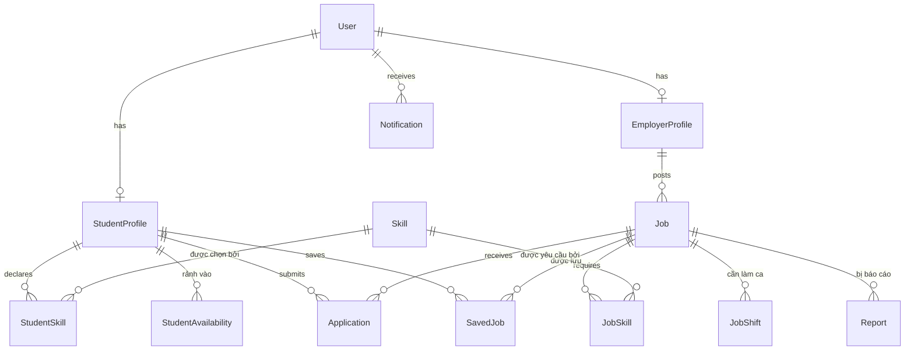

<div align="center">

# UniWork

**Nền tảng tìm & quản lý việc làm bán thời gian cho sinh viên**

Nhà tuyển dụng đăng tin · Sinh viên ứng tuyển · Lọc theo kỹ năng & lịch rảnh · Quản lý hồ sơ

[](https://vercel.com)
[](https://render.com)
[](https://neon.tech)
[](LICENSE)

</div>

---

## 1. Bài toán

Sinh viên tìm việc part-time hiện phải lướt qua các group Facebook — tin trùng lặp, không lọc được theo lịch học, và rất nhiều tin lừa đảo. Nhà tuyển dụng nhỏ (quán cà phê, trung tâm gia sư, sự kiện) thì không có kênh nào để tiếp cận đúng sinh viên có kỹ năng và **rảnh đúng khung giờ** mình cần.

UniWork giải quyết bằng ba việc:

| | |
|---|---|
| **Ghép theo lịch rảnh** | Sinh viên khai báo khung giờ rảnh theo thứ; tin tuyển dụng khai báo ca làm. Hệ thống lọc ra đúng tin mà lịch **giao nhau** — đây là điểm khác biệt chính so với các job board thông thường. |
| **Ghép theo kỹ năng** | Tag kỹ năng chuẩn hoá (không free-text), có mức độ thành thạo, cho phép chấm điểm độ phù hợp. |
| **Luồng tuyển dụng khép kín** | Ứng tuyển → NTD xem → shortlist → nhận/từ chối, có thông báo, có lịch sử. Không rơi vào inbox. |

## 2. Tech stack

Tiêu chí lựa chọn: **miễn phí hoàn toàn ở quy mô đồ án**, một ngôn ngữ duy nhất cho cả hệ thống, và có đủ "chất liệu" kỹ thuật để viết báo cáo (tự triển khai auth, phân quyền, migration, CI).

### Tổng quan

```
┌─────────────────┐      HTTPS/JSON      ┌──────────────────┐     TCP/SSL    ┌──────────────┐
│  apps/web       │ ───────────────────► │  apps/api        │ ─────────────► │ Neon         │
│  React + Vite   │ ◄─────────────────── │  Express + Prisma│ ◄───────────── │ PostgreSQL   │
│  (Vercel)       │      JWT cookie      │  (Render)        │                │ (serverless) │
└─────────────────┘                      └──────────────────┘                └──────────────┘
         │                                        │
         │                                        ├──► Cloudinary  (ảnh, CV PDF)
         └──────── packages/shared ───────────────┤
                   types + zod schemas            └──► Resend      (email OTP, thông báo)
```

### Chi tiết

| Tầng | Công nghệ | Lý do chọn |
|---|---|---|
| **Ngôn ngữ** | TypeScript (strict) | Một ngôn ngữ xuyên suốt FE/BE; type của API dùng chung qua `packages/shared` nên đổi backend là FE báo lỗi compile ngay. |
| **Frontend** | React 19 + Vite | Vite build nhanh, dev server HMR tức thì. React là stack phổ biến nhất, dễ tìm tài liệu. |
| **UI** | Tailwind CSS + shadcn/ui | shadcn copy component vào source (không phải dependency) → tự do sửa, không khoá vendor. Có sẵn form, dialog, table. |
| **State / Data** | TanStack Query + Zustand | Query lo cache/refetch/loading cho dữ liệu server; Zustand chỉ giữ state UI cục bộ (auth, filter). Tránh Redux boilerplate. |
| **Routing** | React Router v7 | SPA thuần, đủ dùng, không cần SSR cho đồ án. |
| **Form** | React Hook Form + Zod | Cùng schema Zod dùng lại ở BE để validate → một nguồn sự thật. |
| **Backend** | Node.js 22 + Express 5 | Nhẹ, chạy tốt trên Render free (512 MB RAM). Middleware rõ ràng, dễ giải thích trong báo cáo. |
| **ORM** | Prisma | Migration có version, Prisma Studio để demo dữ liệu, type sinh tự động từ schema. |
| **Database** | Neon PostgreSQL | Free tier 0.5 GB + branching (tạo DB nhánh cho môi trường test). Quan hệ job–skill–application nhiều-nhiều nên SQL hợp hơn NoSQL. |
| **Auth** | JWT tự triển khai (access + refresh) | Access token 15 phút giữ trong memory; refresh token trong cookie `httpOnly` + `SameSite=None; Secure`. Mật khẩu hash bằng `argon2`. |
| **Validate** | Zod | Validate mọi input ở biên API, suy ra type luôn. |
| **Upload** | Cloudinary (free 25 GB) | Render free có disk **ephemeral** — file upload lên server sẽ mất khi restart, buộc phải dùng object storage ngoài. |
| **Email** | Resend (free 3.000 mail/tháng) | Gửi OTP xác thực email và thông báo trạng thái ứng tuyển. |
| **Test** | Vitest + Supertest + Playwright | Unit cho service, integration cho route, E2E cho 2 luồng chính (đăng tin, ứng tuyển). |
| **CI/CD** | GitHub Actions | Lint + typecheck + test mỗi PR; Vercel/Render tự deploy khi merge vào `main`. |
| **Monorepo** | pnpm workspaces + Turborepo | pnpm tiết kiệm disk, Turbo cache lại build. Vercel/Render đều cho chọn root directory nên 1 repo deploy được 2 nơi. |

### Vì sao **không** chọn

- **Next.js** — full-stack trong một app thì tiện, nhưng đồ án cần thể hiện rõ ranh giới client/server và một REST API độc lập; ngoài ra Next trên Vercel free dễ đụng giới hạn serverless function.
- **Supabase Auth** — làm hộ gần hết phần xác thực/phân quyền, phần đáng giá nhất để báo cáo lại không do mình viết.
- **MongoDB** — dữ liệu ở đây quan hệ dày (job ↔ skill ↔ application ↔ shift), join là chuyện thường ngày.
- **Socket.IO** — Render free ngủ sau 15 phút, kết nối WebSocket đứt liên tục. Giai đoạn đầu dùng polling cho thông báo.

## 3. Hạ tầng miễn phí & bài toán "Render ngủ"

| Dịch vụ | Gói | Hạn mức | Ghi chú |
|---|---|---|---|
| Vercel | Hobby | 100 GB băng thông/tháng | Deploy `apps/web`, tự cấp domain `*.vercel.app` |
| Render | Free Web Service | 512 MB RAM, 750 giờ/tháng | Deploy `apps/api` — **ngủ sau 15 phút không có request** |
| Neon | Free | 0.5 GB, 1 project | Postgres — cũng tự suspend compute, nhưng tự đánh thức trong ~500 ms |
| Cloudinary | Free | 25 GB storage/băng thông | Ảnh đại diện, logo công ty, CV PDF |
| Resend | Free | 3.000 email/tháng | Email OTP & thông báo |
| UptimeRobot / cron-job.org | Free | ping mỗi 5–10 phút | Giữ Render không ngủ |

**Xử lý cold start của Render.** Instance free bị suspend sau 15 phút idle và mất **~50 giây** để dậy — người dùng đầu tiên sau giờ nghỉ sẽ thấy app "treo". Cách xử lý theo thứ tự ưu tiên:

1. **cron-job.org hoặc UptimeRobot** ping `GET /api/health` mỗi 5 phút — đây là cách chính, vì là dịch vụ giám sát chuyên dụng, chạy đúng giờ.
2. **GitHub Actions cron** (`.github/workflows/keep-alive.yml` trong repo này) làm lớp dự phòng. Lưu ý hai hạn chế thật của GitHub Actions: lịch cron **hay bị trễ 5–15 phút** khi runner bận, và workflow **tự bị vô hiệu hoá sau 60 ngày** repo không có commit. Không nên dùng làm phương án duy nhất.
3. **Frontend gọi warm-up sớm**: ngay khi web app mount, bắn một request `/api/health` chạy nền để API kịp dậy trong lúc người dùng còn đang đọc trang chủ.
4. Endpoint `/api/health` phải **cực nhẹ** — chỉ trả `{ status: 'ok' }`, không chạm database, để không tiêu tốn compute-hour của Neon.

## 4. Vai trò & tính năng

### Sinh viên
- Đăng ký / đăng nhập, xác thực email bằng OTP
- Hồ sơ: trường, ngành, năm học, giới thiệu, upload CV (PDF)
- Khai báo **kỹ năng** (kèm mức độ) và **lịch rảnh** theo thứ trong tuần
- Tìm kiếm & lọc tin: từ khoá, kỹ năng, khu vực, mức lương, loại hình, **"chỉ hiện việc khớp lịch rảnh của tôi"**
- Lưu tin, ứng tuyển kèm cover letter, theo dõi trạng thái từng đơn
- Nhận thông báo khi đơn đổi trạng thái

### Nhà tuyển dụng
- Đăng ký tài khoản doanh nghiệp, chờ admin duyệt
- Hồ sơ công ty: tên, logo, mô tả, địa chỉ, website
- CRUD tin tuyển dụng: mô tả, kỹ năng yêu cầu, **ca làm việc**, lương, số lượng, hạn nộp
- Xem danh sách ứng viên kèm **điểm phù hợp**, lọc/sắp xếp, tải CV
- Đổi trạng thái đơn: đã xem → shortlist → nhận / từ chối

### Admin
- Duyệt tài khoản nhà tuyển dụng, duyệt tin đăng
- Quản lý danh mục kỹ năng (chuẩn hoá tag)
- Xử lý báo cáo tin lừa đảo, khoá tài khoản
- Dashboard thống kê: số tin, số đơn, tỉ lệ tuyển thành công

## 5. Mô hình dữ liệu



**Các bảng chính**

| Bảng | Trường đáng chú ý |
|---|---|
| `User` | `email`, `passwordHash`, `role` (STUDENT / EMPLOYER / ADMIN), `emailVerifiedAt`, `status` |
| `StudentProfile` | `fullName`, `university`, `major`, `year`, `bio`, `cvUrl`, `expectedHourlyRate` |
| `EmployerProfile` | `companyName`, `logoUrl`, `website`, `address`, `verifiedAt` |
| `Skill` | `name`, `slug` — danh mục do admin quản lý, tránh tag rác |
| `StudentSkill` | `level` (BEGINNER / INTERMEDIATE / ADVANCED) |
| `Job` | `title`, `description`, `jobType`, `salaryMin/Max`, `salaryType`, `district`, `city`, `isRemote`, `quantity`, `deadline`, `status` (DRAFT / PENDING / OPEN / CLOSED) |
| `JobShift` | `dayOfWeek` (0–6), `startTime`, `endTime` |
| `StudentAvailability` | `dayOfWeek`, `startTime`, `endTime` |
| `Application` | `coverLetter`, `cvUrl`, `status` (PENDING / VIEWED / SHORTLISTED / ACCEPTED / REJECTED / WITHDRAWN), unique `(jobId, studentId)` |
| `Report` | `reason`, `handledBy`, `handledAt` |

**Thuật toán ghép lịch.** Một sinh viên khớp ca làm nếu tồn tại khoảng thời gian rảnh cùng `dayOfWeek` và `[avail.start, avail.end]` **bao trọn** `[shift.start, shift.end]`. Truy vấn bằng `EXISTS` trên Postgres, có index `(dayOfWeek, startTime)`. Điểm phù hợp = `w₁ ×` tỉ lệ kỹ năng khớp `+ w₂ ×` tỉ lệ ca khớp.

## 6. Cấu trúc thư mục

```
uniwork/
├── apps/
│   ├── web/                    # React + Vite  →  Vercel
│   │   └── src/{pages,components,features,lib,hooks}
│   └── api/                    # Express + Prisma  →  Render
│       ├── prisma/{schema.prisma,migrations,seed.ts}
│       └── src/{routes,controllers,services,middlewares,lib}
├── packages/
│   ├── shared/                 # Zod schema + type dùng chung FE/BE
│   └── config/                 # eslint / tsconfig / tailwind preset
├── .github/workflows/
│   ├── ci.yml                  # lint + typecheck + test
│   └── keep-alive.yml          # ping Render (dự phòng)
└── docs/                       # ERD, use case, báo cáo
```

## 7. Lộ trình

| Sprint | Thời lượng | Mục tiêu | Kết quả bàn giao |
|---|---|---|---|
| **0 — Nền móng** | 1 tuần | Monorepo, CI, deploy "hello world" lên Vercel + Render + Neon | Pipeline chạy end-to-end |
| **1 — Auth & Hồ sơ** | 2 tuần | Đăng ký/đăng nhập, JWT + refresh, phân quyền, OTP email, hồ sơ SV & NTD, upload CV | Đăng nhập được với cả 3 vai trò |
| **2 — Tin tuyển dụng** | 2 tuần | CRUD tin, danh mục kỹ năng, ca làm, trang danh sách + chi tiết | NTD đăng tin, SV xem được |
| **3 — Tìm kiếm & Lọc** | 1.5 tuần | Full-text search, lọc đa tiêu chí, lọc theo lịch rảnh, điểm phù hợp, phân trang | Tính năng lõi hoàn chỉnh |
| **4 — Ứng tuyển** | 2 tuần | Nộp đơn, quản lý đơn 2 phía, đổi trạng thái, thông báo + email | Luồng tuyển dụng khép kín |
| **5 — Admin & Hoàn thiện** | 1.5 tuần | Dashboard admin, duyệt NTD/tin, báo cáo vi phạm, responsive, E2E test | Sẵn sàng bảo vệ |
| **6 — Tài liệu** | 1 tuần | Báo cáo, slide, video demo, seed dữ liệu mẫu | Bộ hồ sơ đồ án |

**Nice-to-have** (làm nếu còn thời gian): chat SV ↔ NTD, đánh giá 2 chiều sau khi hoàn thành công việc, gợi ý việc làm cá nhân hoá, PWA, bản đồ việc làm gần trường.

## 8. Bắt đầu

> Sprint 0 chưa hoàn tất — phần code sẽ được scaffold ở bước tiếp theo. Mục này mô tả quy trình dự kiến.

**Yêu cầu:** Node.js ≥ 22, pnpm ≥ 9, một tài khoản [Neon](https://neon.tech) miễn phí.

```bash
git clone https://github.com/khangdzvl050623/uniwork.git
cd uniwork
pnpm install

cp apps/api/.env.example apps/api/.env      # điền DATABASE_URL của Neon
cp apps/web/.env.example apps/web/.env

pnpm --filter api prisma migrate dev        # tạo bảng
pnpm --filter api prisma db seed            # dữ liệu mẫu + tài khoản demo

pnpm dev                                    # web :5173 · api :4000
```

**Biến môi trường**

| Biến | Nơi dùng | Mô tả |
|---|---|---|
| `DATABASE_URL` | api | Chuỗi kết nối Neon (kèm `?sslmode=require`) |
| `JWT_ACCESS_SECRET` / `JWT_REFRESH_SECRET` | api | Khoá ký token, sinh bằng `openssl rand -hex 32` |
| `CORS_ORIGIN` | api | URL của web app trên Vercel |
| `CLOUDINARY_URL` | api | Upload ảnh & CV |
| `RESEND_API_KEY` | api | Gửi email |
| `VITE_API_URL` | web | URL API trên Render |

## 9. Quy trình làm việc với Git

> Mục này dành cho **mọi thành viên trong nhóm**. Đọc hết một lần trước khi commit dòng code đầu tiên.

### 9.1. Cấu trúc nhánh

Dự án dùng 3 tầng nhánh. Code đi từ dưới lên trên, không bao giờ đi ngược lại.

```
feature/ten-tinh-nang  ──PR──►  dev  ──PR (cuối sprint)──►  main
```

| Nhánh | Vai trò | Ai được đẩy code vào |
|---|---|---|
| `main` | Code **luôn chạy ổn định**, là bản đem đi demo/bảo vệ bất cứ lúc nào. Chỉ merge từ `dev` vào **cuối mỗi sprint**. | Không ai push thẳng. Chỉ merge PR từ `dev`. |
| `dev` | Nhánh **tích hợp chung**. Mọi tính năng merge vào đây trước để các phần ghép với nhau và test chung. | Không ai push thẳng. Chỉ merge PR từ `feature/*`. |
| `feature/<ten-tinh-nang>` | Nhánh riêng của từng người cho **từng task**. Xong task thì tạo PR vào `dev` rồi xoá nhánh. | Người phụ trách task đó. |

**Đặt tên nhánh feature theo module**, chữ thường, nối bằng gạch ngang:

```
feature/auth            feature/job-posting      feature/schedule
feature/profile         feature/admin-dashboard  feature/notification
```

Một nhánh = một task. Đừng gom 3 tính năng vào một nhánh — PR sẽ to, khó review, và dễ conflict.

### 9.2. Quy tắc bắt buộc

1. **Không push trực tiếp vào `main` và `dev`.** Repo đã bật branch protection nên thành viên thường sẽ **bị chặn tự động** — nếu bạn thấy lỗi `protected branch hook declined` khi push, nghĩa là bạn đang đứng nhầm nhánh, không phải lỗi máy.
2. **Mọi thay đổi phải đi qua Pull Request** vào `dev`.
3. **Cần ít nhất 1 người review + approve** trước khi PR được merge. Tự approve PR của chính mình là không hợp lệ.
4. Không merge PR khi còn conflict hoặc CI đang đỏ.

### 9.3. Các bước làm việc hàng ngày

Copy nguyên khối lệnh dưới đây và chạy theo thứ tự:

```bash
# 1. Trước khi bắt đầu code, cập nhật dev mới nhất
git checkout dev
git pull origin dev

# 2. Tạo nhánh feature riêng cho task đang làm
git checkout -b feature/ten-tinh-nang

# 3. Code, sau đó commit theo từng phần nhỏ, rõ ràng
git add .
git commit -m "feat: mo ta ngan gon thay doi"

# 4. Trước khi tạo PR, cập nhật lại code mới nhất từ dev để giảm conflict
git checkout dev
git pull origin dev
git checkout feature/ten-tinh-nang
git merge dev

# 5. Push nhánh lên GitHub
git push origin feature/ten-tinh-nang

# 6. Vào GitHub, tạo Pull Request từ feature/ten-tinh-nang vào dev
#    Điền mô tả ngắn gọn: task này làm gì, cách test thử
#    Gắn tag 1 thành viên khác để review
```

Sau khi PR được merge, dọn dẹp nhánh cũ để khỏi rối:

```bash
git checkout dev
git pull origin dev
git branch -d feature/ten-tinh-nang            # xoá nhánh ở máy mình
git push origin --delete feature/ten-tinh-nang # xoá nhánh trên GitHub
```

### 9.4. Quy ước đặt tên commit

Dùng **Conventional Commits** rút gọn: `<loại>: <mô tả ngắn gọn>`.

| Loại | Dùng khi | Ví dụ |
|---|---|---|
| `feat` | Thêm tính năng mới | `feat: them man hinh dang ky sinh vien` |
| `fix` | Sửa lỗi | `fix: sua loi khong luu duoc CV` |
| `docs` | Sửa tài liệu/README | `docs: bo sung huong dan cai dat` |
| `refactor` | Sửa code nhưng **không đổi chức năng** | `refactor: tach logic tinh diem phu hop ra service` |
| `test` | Thêm/sửa test | `test: them test cho API dang nhap` |

Mẹo viết mô tả: viết ở thì hiện tại, nói **việc gì đã làm**, dưới 72 ký tự, không viết hoa đầu câu, không chấm cuối câu. So sánh:

- ❌ `update` · `fix bug` · `sua lai code`
- ✅ `feat: them bo loc viec lam theo lich ranh`

### 9.5. Xử lý conflict

Conflict xảy ra khi hai người cùng sửa một chỗ trong một file. Đây là chuyện bình thường, không phải ai làm sai.

**Nguyên tắc: người tạo ra conflict tự resolve trên máy mình, test lại rồi mới push.** Đừng đẩy conflict sang cho người review.

Khi `git merge dev` ở bước 4 báo conflict:

```bash
git status                     # xem file nào đang conflict
# Mở từng file, tìm các dấu <<<<<<< ======= >>>>>>>
# Giữ lại phần đúng, xoá hết dấu phân cách
git add <file-da-sua>
git commit                     # hoàn tất merge
# CHẠY LẠI APP + TEST trước khi push
```

Nếu rối quá và muốn quay lại trạng thái trước khi merge:

```bash
git merge --abort
```

⚠️ **`prisma/schema.prisma` là file dễ conflict nhất** — cả nhóm đều động vào nó và mỗi thay đổi còn sinh ra file migration mới. **Nếu cần đổi schema, báo nhóm trước trong group chat rồi mới sửa.** Một người sửa xong, merge vào `dev`, những người khác `git pull origin dev` rồi chạy `pnpm --filter api prisma migrate dev` trước khi làm tiếp.

### 9.6. Phân công nhánh theo module

| Nhánh | Module | Người phụ trách |
|---|---|---|
| `feature/auth` | Đăng ký/đăng nhập, phân quyền | *(điền tên)* |
| `feature/job-posting` | Đăng tin, tìm kiếm việc làm | *(điền tên)* |
| `feature/schedule` | Quản lý lịch làm, ứng tuyển | *(điền tên)* |
| `feature/profile` | Hồ sơ sinh viên & nhà tuyển dụng | *(điền tên)* |
| `feature/admin-dashboard` | Trang quản trị, duyệt tin | *(điền tên)* |

> Nhóm tự cập nhật bảng này khi nhận task. Nhận task nào thì điền tên vào đó để tránh hai người làm trùng.

## 10. Giấy phép

[MIT](LICENSE) — dự án học tập, dùng lại thoải mái.
