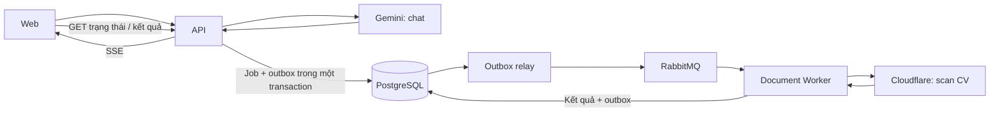

# Guide bắt đầu — Trợ lý AI + Scan CV + RabbitMQ

Guide này đưa bạn từ **planning đã xong** đến **PR đầu tiên**, rồi tới hai luồng chạy được từ đầu đến cuối. Các lệnh chạy ở thư mục gốc repo bằng PowerShell. Đối chiếu repo ngày 2026-09-15.

## 1. Hiểu đúng thứ mình sắp xây

| Phần | Chạy ở đâu | Làm gì |
| --- | --- | --- |
| Trợ lý AI | `apps/api` | Nhận câu hỏi → gọi tool nghiệp vụ → gọi Gemini → stream câu trả lời bằng SSE |
| Scan CV | `apps/worker` | Nhận việc từ RabbitMQ → gọi Cloudflare Workers AI → lưu kết quả để người dùng kiểm tra |
| RabbitMQ | Broker riêng | Chuyển message giữa các bên; không phải model AI, không phải nơi lưu kết quả cuối cùng |
| PostgreSQL | DB hiện có | Lưu trạng thái, kết quả, quota và outbox |



**Outbox** là bảng ghi các message cần gửi. API ghi job và message trong cùng một transaction; relay đọc bảng này để gửi sang RabbitMQ. Nhờ vậy, broker tạm ngắt thì việc đã nhận vẫn còn trong DB để gửi lại.

**Worker** là process Node xử lý nền. Theo thiết kế, local chạy riêng; chế độ inline khởi động cùng API khi môi trường triển khai cần. Không cần dựng thêm HTTP server cho worker.

Nguồn quyết định: [thiet-ke.md](thiet-ke.md). Khi cần lý do, mở tài liệu chuyên đề được dẫn ở từng mục.

## 2. Repo đang có gì, chưa có gì?

| Đã có và dùng được | Cần triển khai |
| --- | --- |
| `apps/api`, `apps/web` | `apps/worker` |
| `packages/shared`, `packages/config` | `packages/contracts`, `packages/messaging`, `packages/ai-runtime` |
| Docker Compose: PostgreSQL, Redis tùy chọn | RabbitMQ dưới profile `mq` |
| Auth, hồ sơ, việc làm, ứng tuyển, upload CV hiện tại | Chat, scan CV, quota AI, outbox, realtime |
| `pnpm dev:local`, `test:db`, Prisma migrations | Script `mq:up`, cấu hình khởi động worker |
| Script thử `spike/thu-workers-ai.mjs` | Pipeline scan sản phẩm và bộ kiểm chất lượng |

**Vì thế, hiện chưa chạy được `pnpm mq:up` hoặc `pnpm --filter @uniwork/worker start`.** Guide sẽ ghi rõ lúc nào những lệnh này dùng được.

### Các chỗ tài liệu cũ dễ làm bạn đi nhầm

- README gốc vẫn nói chưa dùng RabbitMQ và có `EmailQueue`; bộ tài liệu AI đã chỉ ra phần này cần cập nhật khi triển khai.
- Một số dòng trong `07-lo-trinh-14-ngay.md` vẫn ghi scan bằng Gemini, `thu-schema.ts`, queue `retry.1/.2/.3`. Dùng quyết định mới: **Cloudflare cho scan, script `thu-workers-ai.mjs`, retry bằng outbox có `nextTryAt`**.
- Ba đường CV A/B/C đã được chốt. Spike dùng để kiểm khả năng model và chất lượng, không tự thay đổi kiến trúc chỉ vì một file thử thành công.
- RabbitMQ có thể giao lại message. Mục tiêu là **xử lý việc giao trùng an toàn** bằng deduplication và cập nhật có điều kiện; không cam kết model chỉ bị gọi đúng một lần trong mọi tình huống crash.

## 3. Buổi đầu: chuẩn bị và chạy lại app hiện có

### 3.1. Tạo nhánh đầu tiên

Kiểm tra `git status` trước. Nếu đang có thay đổi, commit hoặc cất chúng theo công việc hiện tại rồi mới tạo nhánh.

```powershell
git status
git fetch origin
git switch --no-track -c feature/ai-foundation origin/dev
```

`--no-track` tránh để nhánh mới theo dõi nhầm `origin/dev`. Lần push đầu sẽ chỉ rõ nhánh đích.

### 3.2. Kiểm tra môi trường

Repo chốt **Node 22.x, pnpm 10.33.0** trong `package.json` và CI.

```powershell
node --version
pnpm --version
docker version
pnpm install --frozen-lockfile
```

Bật Docker Desktop trước. Nếu Docker lỗi hoặc máy thiếu RAM, xem [môi trường máy dev](../../docs/moi-truong-may-dev.md).

Chỉ tạo `.env` nếu chưa có, để giữ cấu hình local của bạn:

```powershell
if (!(Test-Path apps/api/.env)) {
  Copy-Item apps/api/.env.example apps/api/.env
}
if (!(Test-Path apps/web/.env)) {
  Copy-Item apps/web/.env.example apps/web/.env
}
```

Kiểm tra `DATABASE_URL` trong `apps/api/.env` trỏ vào **DB local cổng 5433** trước khi chạy migration hoặc seed.

```powershell
pnpm db:wait
pnpm --filter @uniwork/api exec prisma generate
pnpm --filter @uniwork/api exec prisma migrate deploy
```

Với DB local mới cần dữ liệu demo:

```powershell
pnpm --filter @uniwork/api db:seed
```

Chạy app:

```powershell
pnpm dev:local
```

**Đạt khi:** web `http://localhost:5173` mở được, API `http://localhost:4000/api/health` trả thành công, đăng nhập và xem hồ sơ hoạt động. Đây là mốc để so sánh sau mỗi thay đổi hạ tầng.

## 4. Kiểm chứng provider trước khi viết phần tích hợp

Nếu đã có kết quả đo từ lúc planning, kiểm tra chúng rồi dùng lại; không cần đo lại chỉ để hoàn thành checklist.

### 4.1. Gemini — cho chat

1. Mở [hạn mức trong AI Studio](https://aistudio.google.com/rate-limit), chọn đúng project dùng cho UniWork.
2. Kiểm tra model dự kiến trong thiết kế là `gemini-2.5-flash-lite` có dùng được trên project không.
3. Ghi RPM (request/phút), TPM (token/phút), RPD (request/ngày), model và ngày đo vào `docs/gemini-quota-YYYY-MM-DD.md`, kèm ảnh đã che thông tin bí mật.

`AI_PROJECT_REQUESTS_PER_DAY=400` trong plan là cấu hình dự kiến, không phải hạn mức đã đo của tài khoản bạn. Hạn mức thực tế xem theo project trong AI Studio. [Tài liệu Google](https://ai.google.dev/gemini-api/docs/rate-limits).

Một lượt chat có thể gọi model nhiều lần do vòng tool, nên không quy đổi 400 request thành 400 câu hỏi.

### 4.2. Cloudflare — cho scan CV

Chuẩn bị Account ID và API token theo [hướng dẫn Workers AI REST API](https://developers.cloudflare.com/workers-ai/get-started/rest-api/). Script hiện đọc đúng hai biến:

```text
CLOUDFLARE_ACCOUNT_ID
CLOUDFLARE_API_TOKEN
```

Lưu chúng trong `apps/api/.env` local bằng trình soạn thảo. Script không tự đọc `.env`, nên chạy với tùy chọn của Node 22:

```powershell
node --env-file=apps/api/.env plans/ai/spike/thu-workers-ai.mjs "plans/ai/spike/cv/cv-text.pdf"
```

Đường dẫn trên là **file bạn tự chuẩn bị**, chưa được cung cấp sẵn trong repo. Bắt đầu bằng CV giả; sau đó kiểm chất lượng bằng bộ CV được phép sử dụng theo thiết kế.

Thử lần lượt:

| Mẫu | Cần biết |
| --- | --- |
| PDF có lớp text | `/ai/tomarkdown` lấy được đủ nội dung không |
| JPG/PNG một trang | Vision đọc đúng không, JSON có đúng cấu trúc không |
| PDF scan + ảnh từng trang tương ứng | Chất lượng đường vision sau rasterize; riêng script chưa chạy cả pipeline nhiều trang |

**Đọc script trước khi chạy:** nó gửi file sang Cloudflare, gọi nhiều thí nghiệm và có bước gửi `prompt: 'agree'` cho model Llama. Nó cũng in dữ liệu trích xuất ra terminal và lưu response vào `plans/ai/spike/ket-qua/`.

Hai thư mục `spike/cv/` và `spike/ket-qua/` đã được gitignore. Kết quả có tên file cố định và bị ghi đè khi chạy lại; giữ bản riêng theo mẫu nếu cần so sánh. Chỉ commit báo cáo đã bỏ dữ liệu cá nhân.

**Đạt khi:** có báo cáo ghi model, mẫu thử, thời gian, lỗi, độ đúng và usage nếu có. HTTP 200 hoặc `JSON.parse` thành công chưa chứng minh kết quả đủ schema hay đúng nội dung. Script cũng chưa kiểm đầy đủ đường A gồm Markdown → text model → kết quả sản phẩm.

## 5. PR đầu tiên: dựng nền để hai phần cùng dùng

**Nhánh:** `feature/ai-foundation`.

### Việc cần làm

1. Tạo ba package, mỗi package có `package.json`, TypeScript config, exports và các script kiểm tra phù hợp với repo:
   - `@uniwork/contracts`: envelope có version, event CV/chat/realtime, schema kết quả.
   - `@uniwork/messaging`: điểm vào cho connection, publisher, outbox, consumer.
   - `@uniwork/ai-runtime`: cấu hình provider, quota, circuit, telemetry dùng chung.
2. Tạo `@uniwork/worker` với hai file:
   - `worker.ts`: export `startDocumentWorker`, không tự khởi động khi import.
   - `main.ts`: entrypoint khởi động và xử lý shutdown.
3. Thêm dependency `workspace:*`, cấu hình ESLint chặn worker import `apps/api`.
4. Giữ Prisma schema ở `apps/api/prisma/schema.prisma`; API và worker cấp Prisma client cho package dùng chung. Không copy client/config từ API sang worker.
5. Bổ sung cấu hình theo `thiet-ke.md §8`, `.env.example` và env test. Thiếu khóa AI thì app thường vẫn khởi động được. Local dùng `WORKER_INLINE=false`.
6. Kiểm tra cách đọc env của worker khi chạy từ workspace riêng; API có `.env` không có nghĩa worker tự nhận được nó.
7. Cập nhật lockfile và kiểm tra cấu hình Turbo: hiện root `dev` có `--concurrency=3`; nếu thêm tác vụ watch ở package, phải bố trí đủ slot cho mọi task chạy lâu.

Chi tiết contract và ranh giới: [01 — kiến trúc](01-kien-truc-va-ranh-gioi.md).

### Điều kiện hoàn thành PR

- [ ] API/web cũ vẫn chạy khi chưa cấu hình AI và RabbitMQ.
- [ ] Các package resolve được qua tên `@uniwork/...`.
- [ ] Worker typecheck được mà không import API.
- [ ] Import `worker.ts` không tự mở connection hoặc đăng ký consumer.
- [ ] Lint, typecheck, test hiện có và build qua.

Đây là PR dựng cấu trúc; chưa phải bằng chứng pipeline scan đã chạy. Consumer thật được kiểm ở bước messaging.

## 6. Các PR tiếp theo — đi theo phụ thuộc

| Thứ tự | Nhánh gợi ý | Đầu ra cụ thể | Chứng minh đã xong |
| --- | --- | --- | --- |
| 2 | `feature/ai-quota` | Migration các bảng AI, giữ/chốt/hoàn lượt, giới hạn provider, circuit | Ca tranh chấp quota chạy trên Postgres thật; chat và scan có quy tắc chốt riêng |
| 3 | `feature/messaging-outbox` | RabbitMQ local, topology, publisher, outbox relay, consumer, retry và parked message | Rollback không tạo message; broker ngắt không mất outbox; giao trùng không ghi kết quả trùng |
| 4 | `feature/cv-scan-pipeline` | Upload, kiểm file, `cv_extractions`, worker Cloudflare, GET kết quả | Một CV đi `QUEUED → PROCESSING → NEEDS_REVIEW`; API trả `202` trước khi model hoàn tất |
| 5 | `feature/cv-scan-review` | Đối chiếu, ánh xạ kỹ năng, xác nhận bằng transaction và `revision` | Chỉ trường người dùng chọn được lưu; kỹ năng cũ còn nguyên; request dùng revision cũ bị từ chối |
| 6 | `feature/ai-chat` | Session, tool nghiệp vụ, DTO lược dữ liệu cá nhân, SSE | Hỏi việc làm → tool lấy tin thật → câu trả lời có căn cứ; model không nhận trường liên hệ |
| 7 | `feature/chat-handoff` | Socket.IO, quyền phòng, tải bù bằng cursor, chuyển NTD | Chuyển người thật thành công; NTD không đọc được phần chat AI riêng tư; mất socket vẫn tải lại được |

Đây là thứ tự triển khai đề xuất cho một người. Sau nền, quota và messaging có thể do hai người làm riêng khi đã thống nhất contracts và migration. Từng PR sau bắt đầu từ `origin/dev` đã chứa dependency của nó.

Hai tuần là mốc theo dõi trong plan; dùng điều kiện hoàn thành để quyết định chuyển bước, không dùng số ngày để bỏ qua kiểm tra.

### Bước messaging: bắt đầu thế nào?

1. Thêm service RabbitMQ dưới profile `mq` từ [02 §9](02-messaging-rabbitmq.md), cùng volume `rabbitmq_data` ở cuối compose.
2. Thêm script root `mq:up` theo tài liệu đó.
3. Sau khi đã thêm cấu hình, chạy:

```powershell
pnpm mq:up
docker compose --profile mq ps
```

Mở `http://localhost:15672`; cấu hình local trong plan dùng `uniwork / uniwork_dev`. Cổng `15672` để xem quản trị; `5672` để code kết nối AMQP.

4. Dựng topology và dùng handler thử không gọi AI để kiểm đường đi qua DB/outbox/broker/consumer.
5. Sau đó mới nối handler scan thật. Xem tab Consumers của queue để kiểm consumer đã đăng ký; chỉ có connection chưa đủ.

**Bốn điều phải kiểm ngay:**

- Publisher chờ confirm, xử lý message bị `return`; command nghiệp vụ dùng `mandatory: true`.
- Consumer chỉ ACK sau khi transaction lưu kết quả hoặc lịch retry đã commit.
- Lỗi tạm thời đặt `nextTryAt` trong outbox; không dựng ba queue retry TTL theo bảng lịch cũ.
- Xử lý trùng bằng `processed_messages`; worker ghi kết quả theo `leaseOwner` và `runSeq`. Đây là cập nhật có điều kiện: worker cũ không được ghi đè lượt chạy mới.

Khi đã triển khai script `start` và nạp env cho worker, chạy ở terminal riêng:

```powershell
pnpm --filter @uniwork/worker start
```

Để API ở `WORKER_INLINE=false` trong phép thử này.

## 7. Hai mốc demo nên làm trước

### Mốc A — một CV đi hết vòng

```text
Chọn file → API trả 202 → DB có job + outbox
→ RabbitMQ giao việc → worker đọc CV → NEEDS_REVIEW
→ người dùng chọn dữ liệu → xác nhận → hồ sơ cập nhật
```

Kiểm thêm: upload trùng, file sai, model timeout, dừng/khởi động worker, GET kết quả khi không có realtime. Worker chỉ trích xuất; API ánh xạ kỹ năng và cập nhật hồ sơ sau xác nhận.

### Mốc B — một câu hỏi có câu trả lời từ dữ liệu thật

```text
Đăng nhập → tạo phiên → gửi câu hỏi
→ giữ lượt → tool tìm việc thật → Gemini trả lời qua SSE
→ lưu tin nhắn → chốt lượt
```

Làm một tool hoàn chỉnh trước để kiểm luồng, rồi mở rộng đủ tool và vai theo thiết kế. Khi chat ổn mới nối handoff; AI chỉ đề nghị chuyển, người dùng bấm nút mới thực hiện chuyển.

## 8. Kiểm tra và push từng PR

Chạy từng lệnh riêng trong PowerShell, dừng sửa nếu mã thoát khác 0:

```powershell
pnpm lint
$LASTEXITCODE
pnpm --filter @uniwork/api exec prisma generate
$LASTEXITCODE
pnpm typecheck
$LASTEXITCODE
pnpm test
$LASTEXITCODE
pnpm build
$LASTEXITCODE
```

Khi thay quota, unique index, transaction, lease hoặc `revision`, chạy thêm làn DB theo [kế hoạch kiểm thử](08-kiem-thu.md), với database test riêng:

```powershell
pnpm --filter @uniwork/api test:db
$LASTEXITCODE
```

Mock phù hợp để kiểm logic; ràng buộc và ca tranh chấp cần Postgres thật. Broker và provider thật có bản ghi kiểm thử local riêng. Chạy lại những kiểm tra bị ảnh hưởng sau khi merge `dev`.

Ví dụ trước khi push PR đầu tiên, sau khi đã commit phần việc của mình:

```powershell
git fetch origin
git rev-list --left-right --count origin/dev...HEAD
```

Nếu số bên trái lớn hơn 0:

```powershell
git merge origin/dev --no-edit
```

Sửa conflict nếu có, commit kết quả và kiểm tra lại, rồi:

```powershell
git push -u origin feature/ai-foundation
```

Mở PR vào `dev`. Mô tả ghi **đã làm gì, chạy thử bằng cách nào, bằng chứng đạt**. Với nhánh sau, thay tên nhánh cho đúng.

## 9. Checklist bắt tay vào làm ngay

- [ ] App hiện tại chạy được trên local.
- [ ] Đã xem kết quả đo Gemini và Cloudflare; ghi rõ phần chưa kiểm chứng.
- [ ] Đã tạo `feature/ai-foundation` từ `origin/dev`.
- [ ] Bắt đầu bằng **contracts → khung messaging/ai-runtime → khung worker → env/ESLint**.
- [ ] PR nền qua kiểm tra, rồi mới chuyển quota và messaging.

**Việc đầu tiên trong code:** mở cấu trúc `packages/shared` và `packages/config` làm mẫu cấu hình workspace; tạo `packages/contracts` theo `01 §3`, sau đó kiểm typecheck trước khi tạo package tiếp theo.
