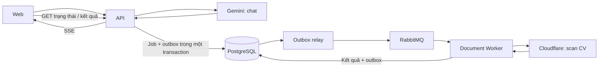

# Guide bắt đầu — Trợ lý AI + Scan CV + RabbitMQ

Guide này đưa hai người từ **chỗ đang đứng** tới **hai luồng chạy được từ đầu đến cuối**. Các lệnh chạy ở thư mục gốc repo bằng PowerShell.

**Đối chiếu repo ngày 2026-09-22, nhánh `feature/ai-tro-ly`, 8 commit.** Trợ lý AI đã trả lời được bằng dữ liệu thật; Scan CV và RabbitMQ chưa bắt đầu. Xem [§5](#5-đã-xong--trợ-lý-ai-chạy-được-đầu-cuối) trước khi đọc phần chia việc.

## 1. Hiểu đúng thứ mình sắp xây

| Phần | Chạy ở đâu | Làm gì |
| --- | --- | --- |
| Trợ lý AI | `apps/api` | Nhận câu hỏi → gọi tool nghiệp vụ → gọi Gemini → stream câu trả lời bằng SSE |
| Scan CV | `apps/worker` | Nhận việc từ RabbitMQ → gọi Cloudflare Workers AI → lưu kết quả để người dùng kiểm tra |
| RabbitMQ | Broker riêng | Chuyển message giữa các bên; không phải model AI, không phải nơi lưu kết quả cuối cùng |
| PostgreSQL | DB hiện có | Lưu trạng thái, kết quả, quota và outbox |



**Outbox** là bảng ghi các message cần gửi. API ghi job và message trong cùng một transaction; relay đọc bảng này để gửi sang RabbitMQ. Nhờ vậy, broker tạm ngắt thì việc đã nhận vẫn còn trong DB để gửi lại.

**Worker** là process Node xử lý nền. Theo thiết kế, local chạy riêng; chế độ inline khởi động cùng API khi môi trường triển khai cần. Không cần dựng thêm HTTP server cho worker.

Nguồn quyết định: [thiet-ke.md](thiet-ke.md). Khi cần lý do, mở tài liệu chuyên đề được dẫn ở từng mục.

## 2. Repo đang có gì, chưa có gì?

| Đã có và chạy được | Chưa có |
| --- | --- |
| `apps/api`, `apps/web`, `packages/shared`, `packages/config` | `apps/worker` |
| **`packages/ai-runtime`** — provider, quota, `chayLuotChat` | `packages/contracts`, `packages/messaging` |
| **Bảng AI + chat**, 4 CHECK, 1 chỉ mục unique một phần | Bảng `cv_extractions`, `outbox_messages`, `processed_messages`, `user_presence` |
| **Trợ lý AI chạy thật**: 9 tool, SSE, Socket.IO | Máy trạng thái handoff — hiện **chưa ai chuyển được phiên sang NTD** |
| Auth, hồ sơ, việc làm, ứng tuyển, upload CV | Toàn bộ Scan CV |
| Docker Compose: PostgreSQL, Redis tuỳ chọn | RabbitMQ dưới profile `mq` |
| `pnpm dev:local`, `test:db`, Prisma migrations | Script `mq:up`, khởi động worker |
| `thu-gemini`, `thu-tro-ly` — đã đo provider và một lượt thật | `spike/thu-workers-ai.mjs` **chưa ai chạy với CV thật** |
| | **Giao diện chat ở `apps/web` — chưa có một dòng nào** |

Hai dòng cuối là hai chỗ dễ tưởng đã xong nhất. Backend chat trả lời được qua script và qua test, nhưng **chưa người dùng nào gõ được câu nào trên trình duyệt**.

**Vì thế, hiện chưa chạy được `pnpm mq:up` hoặc `pnpm --filter @uniwork/worker start`.** Guide ghi rõ ở [§6](#6-chia-việc-cho-hai-người) lúc nào những lệnh này dùng được.

### Các chỗ tài liệu cũ dễ làm bạn đi nhầm

- README gốc vẫn nói chưa dùng RabbitMQ và có `EmailQueue`; bộ tài liệu AI đã chỉ ra phần này cần cập nhật khi triển khai.
- Một số dòng trong `07-lo-trinh-14-ngay.md` vẫn ghi scan bằng Gemini, `thu-schema.ts`, queue `retry.1/.2/.3`. Dùng quyết định mới: **Cloudflare cho scan, script `thu-workers-ai.mjs`, retry bằng outbox có `nextTryAt`**.
- Ba đường CV A/B/C đã được chốt. Spike dùng để kiểm khả năng model và chất lượng, không tự thay đổi kiến trúc chỉ vì một file thử thành công.
- **Thứ tự PR trong `07-lo-trinh-14-ngay.md` đã cũ.** Nó viết cho một người và cho lúc chưa có gì. Dùng [§6](#6-chia-việc-cho-hai-người).
- RabbitMQ có thể giao lại message. Mục tiêu là **xử lý việc giao trùng an toàn** bằng deduplication và cập nhật có điều kiện; không cam kết model chỉ bị gọi đúng một lần trong mọi tình huống crash.

## 3. Buổi đầu: chuẩn bị và chạy lại app hiện có

### 3.1. Tạo nhánh đầu tiên

Kiểm tra `git status` trước. Nếu đang có thay đổi, commit hoặc cất chúng theo công việc hiện tại rồi mới tạo nhánh.

```powershell
git status
git checkout dev
git pull --ff-only origin dev
git checkout -b feature/chat-handoff      # A1 — hoặc feature/messaging-nen cho B1
```

**Đừng bỏ bước `pull`.** Nhánh `dev` bật *Require branches to be up to date*, nên tách từ bản local cũ là nhánh **sinh ra đã out-of-date** trước khi viết dòng nào. Đo thật 2026-09-15: local `dev` cũ 13 tiếng, `origin/dev` đã hơn 6 commit.

`--ff-only` là chốt an toàn: local `dev` lỡ có commit riêng thì nó **báo lỗi thay vì merge ngầm**. Quy trình đầy đủ ở `README.md` §9.3.

### 3.2. Kiểm tra môi trường

Repo chốt **Node 22.x, pnpm 10.33.0** trong `package.json` và CI.

```powershell
node --version
pnpm --version
docker version
pnpm install --frozen-lockfile
```

Bật Docker Desktop trước. Nếu Docker lỗi hoặc máy thiếu RAM, xem [môi trường máy dev](../../docs/moi-truong-may-dev.md).

Chỉ tạo `.env` nếu chưa có, để giữ cấu hình local của bạn:

```powershell
if (!(Test-Path apps/api/.env)) {
  Copy-Item apps/api/.env.example apps/api/.env
}
if (!(Test-Path apps/web/.env)) {
  Copy-Item apps/web/.env.example apps/web/.env
}
```

Kiểm tra `DATABASE_URL` trong `apps/api/.env` trỏ vào **DB local cổng 5433** trước khi chạy migration hoặc seed.

```powershell
pnpm db:wait
pnpm --filter @uniwork/api exec prisma generate
pnpm --filter @uniwork/api exec prisma migrate deploy
```

Với DB local mới cần dữ liệu demo:

```powershell
pnpm --filter @uniwork/api db:seed
```

Chạy app:

```powershell
pnpm dev:local
```

**Đạt khi:** web `http://localhost:5173` mở được, API `http://localhost:4000/api/health` trả thành công, đăng nhập và xem hồ sơ hoạt động. Đây là mốc để so sánh sau mỗi thay đổi hạ tầng.

## 4. Kiểm chứng provider trước khi viết phần tích hợp

Nếu đã có kết quả đo từ lúc planning, kiểm tra chúng rồi dùng lại; không cần đo lại chỉ để hoàn thành checklist.

### 4.1. Gemini — cho chat · ĐÃ ĐO XONG

```powershell
pnpm --filter @uniwork/api thu-gemini      # kiểm khoá và model
pnpm --filter @uniwork/api thu-tro-ly      # chạy MỘT lượt thật, có tool, có database
```

Kết quả 2026-09-21, ghi đầy đủ ở [00 C.1](00-khao-sat.md):

| | |
| --- | --- |
| Model dùng được | **`gemini-3.5-flash-lite`** — `gemini-2.5-flash-lite` bị Google chặn với tài khoản mới, dù bảng giá vẫn liệt kê |
| Một lượt 1 vòng tool | 4.395 token vào / 93 ra · chữ đầu 2,8 s |
| Một lượt 3 vòng tool | **9.889** token vào / 158 ra · chữ đầu 4,3 s |
| Phần cố định mỗi request | 6.559 ký tự ≈ 2.000 token — gửi lại ở **mọi** bước |

**Còn phải đo:** RPM/TPM/RPD của chính project — mở [AI Studio](https://aistudio.google.com/rate-limit), ghi vào `docs/gemini-quota-YYYY-MM-DD.md` kèm ảnh đã che thông tin bí mật.

`AI_PROJECT_REQUESTS_PER_DAY=400` trong plan là cấu hình dự kiến, không phải hạn mức đã đo của tài khoản bạn. Hạn mức thực tế xem theo project trong AI Studio. [Tài liệu Google](https://ai.google.dev/gemini-api/docs/rate-limits).

Một lượt chat gọi model **một lần cho mỗi bước**, và số đo ở trên cho thấy 3 vòng tool là chuyện bình thường. Không quy đổi 400 request thành 400 câu hỏi.

### 4.2. Cloudflare — cho scan CV · CHƯA AI CHẠY

Chuẩn bị Account ID và API token theo [hướng dẫn Workers AI REST API](https://developers.cloudflare.com/workers-ai/get-started/rest-api/). Script hiện đọc đúng hai biến:

```text
CLOUDFLARE_ACCOUNT_ID
CLOUDFLARE_API_TOKEN
```

Lưu chúng trong `apps/api/.env` local bằng trình soạn thảo. Script không tự đọc `.env`, nên chạy với tùy chọn của Node 22:

```powershell
node --env-file=apps/api/.env plans/ai/spike/thu-workers-ai.mjs "plans/ai/spike/cv/cv-text.pdf"
```

Đường dẫn trên là **file bạn tự chuẩn bị**, chưa được cung cấp sẵn trong repo. Bắt đầu bằng CV giả; sau đó kiểm chất lượng bằng bộ CV được phép sử dụng theo thiết kế.

Thử lần lượt:

| Mẫu | Cần biết |
| --- | --- |
| PDF có lớp text | `/ai/tomarkdown` lấy được đủ nội dung không |
| JPG/PNG một trang | Vision đọc đúng không, JSON có đúng cấu trúc không |
| PDF scan + ảnh từng trang tương ứng | Chất lượng đường vision sau rasterize; riêng script chưa chạy cả pipeline nhiều trang |

**Đọc script trước khi chạy:** nó gửi file sang Cloudflare, gọi nhiều thí nghiệm và có bước gửi `prompt: 'agree'` cho model Llama. Nó cũng in dữ liệu trích xuất ra terminal và lưu response vào `plans/ai/spike/ket-qua/`.

Hai thư mục `spike/cv/` và `spike/ket-qua/` đã được gitignore. Kết quả có tên file cố định và bị ghi đè khi chạy lại; giữ bản riêng theo mẫu nếu cần so sánh. Chỉ commit báo cáo đã bỏ dữ liệu cá nhân.

**Đạt khi:** có báo cáo ghi model, mẫu thử, thời gian, lỗi, độ đúng và usage nếu có. HTTP 200 hoặc `JSON.parse` thành công chưa chứng minh kết quả đủ schema hay đúng nội dung. Script cũng chưa kiểm đầy đủ đường A gồm Markdown → text model → kết quả sản phẩm.

## 5. Đã xong — trợ lý AI chạy được đầu cuối

Tám commit trên `feature/ai-tro-ly`, tách từ `dev`. Mỗi commit qua đủ lint / typecheck / test trước khi tạo.

| # | Commit | Thêm gì |
| --- | --- | --- |
| 1 | `d112353` | `packages/ai-runtime`: cấu hình, provider Gemini, ba hàm ngày (`ngayVN` cho quota người dùng, `ngayPacific` cho RPD của Google, `ngayUTC` cho Cloudflare) |
| 2 | `c79b84f` | `ai_usage_days` + `ai_turns`; `giuLuot` bằng **một** câu `INSERT … ON CONFLICT … DO UPDATE WHERE`; chỉ mục unique **một phần** `ai_turns_mot_luot_dang_chay` |
| 3 | `53955bd` | `chat_sessions` + `chat_messages`; **4 CHECK viết tay** tách vai "chủ phiên" khỏi "NTD nhận handoff" |
| 4 | `9fa9926` | 9 tool sinh viên; `luoc-pii.ts` với **danh sách CHO PHÉP**; `gon-lai.ts` thu một tin từ ~700 xuống ~60 token; 13 chủ đề hướng dẫn viết tay |
| 5 | `9a0d20e` | SSE `POST /api/tro-ly/hoi`; ba việc trong **một** transaction; ghi trả lời **có điều kiện**; `chotLuot` / `hoanLuot` |
| — | `42327f8` | Số đo thật từ `thu-gemini`, và chi phí cố định mỗi request |
| — | `387642f` | Sửa lỗi chỉ chạy thật mới lộ: sự kiện "đang tra cứu" bắn **sau** câu trả lời |
| 6 | `78b89bc` | Socket.IO; `quyenTruyCapPhien()` dùng chung REST + socket; cursor đục; `guiTinNhan()` |

### Đang chạy được

| Đường | Kiểu |
| --- | --- |
| `POST /api/hoi-thoai` · `GET`/`POST /api/hoi-thoai/:id/tin-nhan` | REST |
| `POST /api/tro-ly/hoi` (SSE) · `GET /api/tro-ly/luot-con-lai` | REST |
| `hoi-thoai:vao` · `:ra` · `:gui` · `:tai-bu` · `:dang-go` | Socket.IO — đều có ACK trừ `dang-go` |

**516 test làn thường · 88 test làn database.** Chạy `pnpm test` và `pnpm --filter @uniwork/api test:db`.

### Bảy luật đã cưỡng chế bằng code — đừng phá

1. **Chỉ `packages/ai-runtime` được import `ai`.** `apps/api` dùng `tool` xuất lại từ đó. Nâng cấp SDK là sửa một chỗ.
2. **`userId` nằm trong closure**, không có trong `inputSchema` của bất kỳ tool nào. Model không *diễn đạt được* yêu cầu dữ liệu của người khác.
3. **`raSoat()` là cổng ra duy nhất của DTO gửi model.** Khoá lạ ⇒ ném `LoLotPII` (lỗi người viết code). Chuỗi chứa sđt/email ⇒ che (dữ liệu thật hợp lệ).
4. **Tool gọi service, không gọi Prisma.** Tầng kiểm quyền đã có sẵn và đã được test.
5. **Không tool nào ghi.** Injection thành công nhất cũng chỉ khiến model *nói* sai một câu.
6. **Kiểm xong hết rồi mới mở kênh SSE.** Sau khi header đi, HTTP status đóng băng ở 200 vĩnh viễn.
7. **Hai phòng socket, không phải một.** Phòng chung nghĩa là NTD nhận realtime từng câu sinh viên nói riêng với trợ lý.

### Chưa làm, cố ý

Handoff · giao diện web · 3 tool NTD · `UserPresence` · circuit breaker · bộ 40 câu đánh giá. Toàn bộ nằm trong phần chia việc dưới đây.

## 6. Chia việc cho hai người

Nền dùng chung đã xong, nên hai làn dưới đây **song song thật**: A không đợi RabbitMQ, B không đợi handoff. Mỗi PR tách từ `origin/dev` đã chứa phụ thuộc của nó.

### Người A — đi nốt phần chat

| # | Nhánh | Đầu ra | Chứng minh đã xong |
| --- | --- | --- | --- |
| A1 | `feature/chat-handoff` | Năm chuyển đổi: `chuyen-ntd` · `huy-cho` · `tiep-nhan` · `quay-lai-ai` · `ket-thuc`. `handoffEmployerProfileId` đóng băng ở lần chuyển đầu; `employerVisibleFromSeq` chỉ đặt khi đang `null`; huỷ lượt AI đang chạy nếu bấm chuyển giữa chừng | Chuyển xong thì `duocGui` bật cho cả hai bên; NTD **không** đọc được phần chat AI riêng tư; đổi trạng thái giữa lúc model đang viết thì câu trả lời bị **bỏ**, lượt vẫn `SUCCEEDED` |
| A2 | `feature/chat-web` | Giao diện: đọc SSE, nối Socket.IO, giữ cursor, gửi lại theo `clientMessageId`, nút "nhắn nhà tuyển dụng" | Gõ câu hỏi trên trình duyệt và thấy chữ chảy ra; rút mạng 5 giây rồi cắm lại — **không mất và không nhân đôi** tin nào |
| A3 | `feature/chat-ntd` | 3 tool vai NTD (`xemTinCuaToi`, `xemChiTietTinCuaToi`, `xemUngVien`) + prompt vai NTD; `hoTenVietTat` cho danh sách ứng viên | Ca canh PII chạy trên **cả** bộ tool NTD và vẫn xanh: không sđt, không email, không họ tên đầy đủ |
| A4 | `feature/chat-do-luong` | Bộ 40 câu nhãn tay, chấm hai trục (hành vi / có căn cứ); circuit breaker | Công bố số ca từng nhóm; trục "có căn cứ" phải **100 %** — một câu bịa lương là chặn phát hành |

### Người B — hạ tầng message và Scan CV

| # | Nhánh | Đầu ra | Chứng minh đã xong |
| --- | --- | --- | --- |
| B1 | `feature/messaging-nen` | `packages/contracts` (envelope có version) + `packages/messaging` (connection, publisher, consumer); RabbitMQ dưới profile `mq`; script `mq:up` | `pnpm mq:up` lên được; tab **Consumers** của queue thấy consumer đã đăng ký — chỉ có connection là chưa đủ |
| B2 | `feature/messaging-outbox` | `outbox_messages` + relay + `processed_messages`; publisher chờ confirm và xử lý `return`; retry bằng `nextTryAt` | Rollback **không** tạo message; tắt broker giữa chừng **không** mất outbox; giao trùng **không** ghi kết quả trùng |
| B3 | `feature/worker` | `apps/worker`: `worker.ts` xuất `startDocumentWorker` (import không tự chạy), `main.ts` là entrypoint; ESLint chặn worker import `apps/api` | Worker typecheck mà không import API; import `worker.ts` không tự mở connection |
| B4 | `feature/cv-scan-pipeline` | Upload, kiểm file, `cv_extractions`, handler Cloudflare, GET kết quả | Một CV đi `QUEUED → PROCESSING → NEEDS_REVIEW`; API trả **202** trước khi model xong |
| B5 | `feature/cv-scan-review` | Đối chiếu, ánh xạ kỹ năng, xác nhận bằng transaction và `revision` | Chỉ trường người dùng chọn được lưu; kỹ năng cũ còn nguyên; request dùng `revision` cũ bị **từ chối** |

**Việc đầu tiên của B, trước cả B1:** chạy `spike/thu-workers-ai.mjs` với CV thật (xem §4.2). Nó quyết định đường trích xuất PDF. Làm sai thứ tự là xây cả pipeline cho một model có thể không đọc nổi CV.

### Bốn điểm chạm — thống nhất trước khi code

**1. `schema.prisma` và migration.** Cả hai đều thêm bảng. Luật: `git pull origin dev` **ngay trước** khi chạy `prisma migrate dev`, và **không bao giờ sửa migration đã push**. Người merge sau tạo migration mới, không sửa file cũ.

> **Tuyệt đối không `prisma db push`.** Bốn CHECK và chỉ mục unique một phần **không có trong `schema.prisma`** — Prisma không khai được chúng. `db push` dựng ra một database **không có ràng buộc nào** và không báo gì cả.

**2. Chỉ mục `ai_turns_mot_luot_dang_chay` đang khoá theo `userId`, KHÔNG theo `(userId, feature)`.**

```sql
CREATE UNIQUE INDEX "ai_turns_mot_luot_dang_chay"
  ON "ai_turns" ("userId") WHERE state = 'RESERVED';
```

Hôm nay vô hại vì mới có mỗi chat. Khi B nối Scan CV vào, một người đang quét CV — lượt chạy trong worker hàng chục giây — sẽ **không hỏi được trợ lý**, và nhận `409 AI_BUSY` mà không hiểu vì sao.

Đây là quyết định cần chốt, không phải bug ai đó tự sửa: đổi sang `(userId, feature)` thì mất luật "một lượt AI mỗi tài khoản"; giữ nguyên thì hai tính năng chặn nhau. **B chốt trước khi bắt đầu B4.**

**3. Bộ phát realtime.** `chat.service` gọi `phatToiPhong()` và không import socket.io. Hôm nay `socket.gateway.ts` đăng ký một bộ phát bắn thẳng vào `io`; khi cần nhiều instance, **B đổi đúng chỗ đăng ký đó** sang publish qua RabbitMQ — A không sửa gì. Ranh giới: **A quyết định phát cái gì, B quyết định nó đi thế nào.**

**4. `packages/contracts` là của B, và A không cần chờ nó.** Kiểu của chat cứ nằm ở `packages/shared` như hiện tại. Đừng dời sang `contracts` giữa chừng chỉ để "gọn" — dời là A phải đợi B, mà đó đúng là thứ cách chia này đang tránh.

### Nếu chỉ có một người làm

Thứ tự: **A1 → A2 → B1 → B2 → B3 → B4 → B5 → A3 → A4.**

Xong handoff và giao diện thì chat đã là một tính năng hoàn chỉnh, demo được, rồi mới mở mặt trận thứ hai.

Hai tuần là mốc theo dõi trong plan. Dùng cột "chứng minh đã xong" để quyết định chuyển bước, không dùng số ngày để bỏ qua kiểm tra.

### Bước messaging: bắt đầu thế nào?

1. Thêm service RabbitMQ dưới profile `mq` từ [02 §9](02-messaging-rabbitmq.md), cùng volume `rabbitmq_data` ở cuối compose.
2. Thêm script root `mq:up` theo tài liệu đó.
3. Sau khi đã thêm cấu hình, chạy:

```powershell
pnpm mq:up
docker compose --profile mq ps
```

Mở `http://localhost:15672`; cấu hình local trong plan dùng `uniwork / uniwork_dev`. Cổng `15672` để xem quản trị; `5672` để code kết nối AMQP.

4. Dựng topology và dùng handler thử **không gọi AI** để kiểm đường đi qua DB → outbox → broker → consumer.
5. Sau đó mới nối handler scan thật. Xem tab Consumers của queue để kiểm consumer đã đăng ký; chỉ có connection là chưa đủ.

**Bốn điều phải kiểm ngay:**

- Publisher chờ confirm, xử lý message bị `return`; command nghiệp vụ dùng `mandatory: true`.
- Consumer chỉ ACK sau khi transaction lưu kết quả hoặc lịch retry đã commit.
- Lỗi tạm thời đặt `nextTryAt` trong outbox; **không** dựng ba queue retry TTL theo bảng lịch cũ.
- Xử lý trùng bằng `processed_messages`; worker ghi kết quả theo `leaseOwner` và `runSeq`. Đây là cập nhật **có điều kiện**: worker cũ không được ghi đè lượt chạy mới.

Khi đã có script `start` và nạp env cho worker, chạy ở terminal riêng:

```powershell
pnpm --filter @uniwork/worker start
```

Để API ở `WORKER_INLINE=false` trong phép thử này.

## 7. Hai mốc demo

### Mốc B — một câu hỏi có câu trả lời từ dữ liệu thật · ĐÃ ĐẠT Ở BACKEND

```text
Đăng nhập → tạo phiên → gửi câu hỏi
→ giữ lượt → tool tìm việc thật → Gemini trả lời qua SSE
→ lưu tin nhắn → chốt lượt
```

Chạy lại bất cứ lúc nào:

```powershell
pnpm --filter @uniwork/api thu-tro-ly "em rảnh tối thứ 2 thứ 4, có việc nào hợp lịch em không?"
```

Lượt thật ngày 2026-09-21 gọi ba vòng tool (`timViecLam` → `xemLichRanhCuaToi` → `timViecLam`), đọc đúng bốn ô lịch rảnh từ database, và **nói "chưa có việc nào khớp" thay vì bịa một tin**.

**Chưa đạt phần giao diện.** Mốc B chỉ khép lại khi gõ được câu hỏi trên trình duyệt và thấy chữ chảy ra — đó là việc A2.

### Mốc A — một CV đi hết vòng · CHƯA BẮT ĐẦU

```text
Chọn file → API trả 202 → DB có job + outbox
→ RabbitMQ giao việc → worker đọc CV → NEEDS_REVIEW
→ người dùng chọn dữ liệu → xác nhận → hồ sơ cập nhật
```

Kiểm thêm: upload trùng, file sai, model timeout, dừng/khởi động worker, GET kết quả khi không có realtime. Worker **chỉ trích xuất**; API ánh xạ kỹ năng và cập nhật hồ sơ sau khi người dùng xác nhận.

## 8. Kiểm tra và push từng PR

Chạy từng lệnh riêng trong PowerShell, dừng sửa nếu mã thoát khác 0:

```powershell
pnpm lint
$LASTEXITCODE
pnpm --filter @uniwork/api exec prisma generate
$LASTEXITCODE
pnpm typecheck
$LASTEXITCODE
pnpm test
$LASTEXITCODE
pnpm build
$LASTEXITCODE
```

Khi thay quota, unique index, transaction, lease hoặc `revision`, chạy thêm làn DB theo [kế hoạch kiểm thử](08-kiem-thu.md), với database test riêng:

```powershell
pnpm --filter @uniwork/api test:db
$LASTEXITCODE
```

Mock phù hợp để kiểm logic; ràng buộc và ca tranh chấp cần Postgres thật. Broker và provider thật có bản ghi kiểm thử local riêng. Chạy lại những kiểm tra bị ảnh hưởng sau khi merge `dev`.

Trước khi push, sau khi đã commit phần việc của mình — với **hai người cùng đẩy vào `dev`** thì bước này không bỏ được:

```powershell
git fetch origin
git rev-list --left-right --count origin/dev...HEAD
```

Nếu số bên trái lớn hơn 0:

```powershell
git merge origin/dev --no-edit
```

Sửa conflict nếu có, commit kết quả và kiểm tra lại, rồi:

```powershell
git push -u origin <ten-nhanh-cua-ban>
```

Mở PR vào `dev`. Mô tả ghi **đã làm gì, chạy thử bằng cách nào, bằng chứng đạt**. Với nhánh sau, thay tên nhánh cho đúng.

## 9. Checklist bắt tay vào làm ngay

### Cả hai người

- [ ] `pnpm install --frozen-lockfile`, Docker Desktop bật, `pnpm db:wait`.
- [ ] `pnpm --filter @uniwork/api exec prisma migrate deploy` — nhánh này thêm **hai** migration.
- [ ] App cũ vẫn chạy: web `:5173`, API `:4000/api/health`.
- [ ] Có `GOOGLE_GENERATIVE_AI_API_KEY` trong `apps/api/.env`, rồi `pnpm --filter @uniwork/api thu-gemini`.
- [ ] Đọc [§5](#5-đã-xong--trợ-lý-ai-chạy-được-đầu-cuối) — nhất là **bảy luật đã cưỡng chế bằng code**.
- [ ] Thống nhất **bốn điểm chạm** ở [§6](#bốn-điểm-chạm--thống-nhất-trước-khi-code), đặc biệt là quyết định về chỉ mục `ai_turns_mot_luot_dang_chay`.

### Người A

- [ ] `pnpm --filter @uniwork/api thu-tro-ly` chạy được và trả lời có căn cứ.
- [ ] Đọc `apps/api/src/modules/chat/chat.access.ts` trước tiên — `quyenTruyCapPhien()` là chỗ A1 sửa nhiều nhất.
- [ ] Tách `feature/chat-handoff` từ `origin/dev` **sau khi** nhánh này đã merge.

### Người B

- [ ] Có `CLOUDFLARE_ACCOUNT_ID` và `CLOUDFLARE_API_TOKEN`.
- [ ] **Chạy `spike/thu-workers-ai.mjs` với CV thật trước khi viết dòng code nào** — nó chốt đường trích xuất PDF.
- [ ] Đọc `packages/ai-runtime/src/quota.ts` — `giuLuot` / `chotLuot` / `hoanLuot` dùng lại được cho `CV_SCAN`, không viết lại.
- [ ] Đọc `apps/api/src/modules/chat/phat-su-kien.ts` — khe cắm B sẽ đổi sang RabbitMQ.
- [ ] Tách `feature/messaging-nen` từ `origin/dev`.

**Việc đầu tiên trong code của B:** mở `packages/ai-runtime` làm mẫu cấu hình workspace (nó là package mới nhất và đúng nếp repo nhất), rồi tạo `packages/contracts` theo [01 §3](01-kien-truc-va-ranh-gioi.md), typecheck xong mới tạo package tiếp theo.
